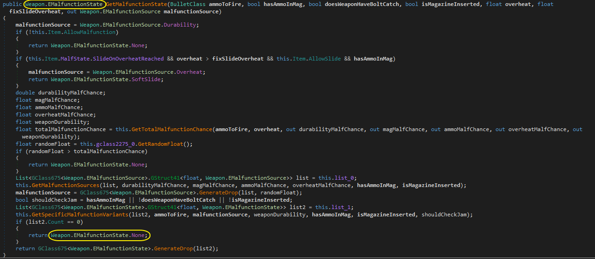

# Untitled.Reflection

라이브러리 사용법

Untitled.Reflection.dll 파일을 참조 추가하셔야합니다.
BepInEx\plugins 폴더에도 넣어두시면됩니다.

---

## Docs 링크

BepinEx docs사이트 입니다.

<https://docs.bepinex.dev/articles/dev_guide/plugin_tutorial/2_plugin_start.html>

---

클라이언트 사이드 모드 기초 docs입니다.

<https://hub.sp-tarkov.com/doc/entry/47-tutorial-updating-old-pre-2-3-0-module-mods-to-the-new-plugin-system/>

---

Harmony 라이브러리 docs링크입니다.

<https://harmony.pardeike.net/articles/intro.html>
<https://dotnetcademy.net/Learn/4/Pages/2>

---

```c#
public PatchAttribute(string Class, string Method)
// Class이름, Method이름을 통해 함수를 찾습니다.
// ex: [Patch("FirearmController", "GetMalfunctionState"))]

public PatchAttribute(string Class, string Method, Type[] parameters)
// Class이름, Method이름, Type Parameters를 통해 함수를 찾습니다.
// Profile.Examined 함수는 같은 이름으로 파라미터만 다르게 총 2개가 구현되어있으며 해당 함수중
// 원하는걸 호출할때 사용합니다.
// ex: [Patch("Profile", "Examined"), new[] { typeof(string) })]
// ex: [Patch("Profile", "Examined"), new[] { typeof(Item) })]

public PatchAttribute(string Class, params string[] args)
// Class이름, 파라미터 이름을 통해 함수를 찾습니다.
// ex: [Patch("Profile", "item")]
// ex: [Patch("Profile", "templateId")]

public PatchAttribute(string Class, Type parametertype, params string[] args)
// Class이름. 첫번째 파라미터 타입, 파라미터 이름을 통해 함수를 찾습니다.
// ex: [Patch("Profile", typeof(string), "templateId")]

public PatchAttribute(Type Class, string Method)
// Class타입, Method이름을 통해 함수를 찾습니다.
// ex: [Patch(typeof(Profile), "Examined")]

public PatchAttribute(Type Class, string Method, Type[] parameters)
// Class타입, Method이름, Type Parameters를 통해 함수를 찾습니다.
// ex: [Patch(typeof(Profile), "Examined", new[] { typeof(string) })]
// ex: [Patch(typeof(Profile), "Examined", new[] { typeof(Item) })]

public PatchAttribute(Type Class, Type parametertype, params string[] args)
// Class타입, 첫번째 파라미터 타입, 파라미터 이름을 통해 함수를 찾습니다.
// args는 해당 함수의 파라미터 갯수만큼 이름을 넣어주셔야 합니다.
// ex: [Patch(클래스타입, 파라미터1 타입, "파라미터1", "파라미터2")]
// ex: [Patch(typeof(Profile), typeof(string), "templateId")]
// ex: [Patch(typeof(Profile), typeof(Item), "item")]


public PatchAttribute(bool parameteronly, params string[] args)
// bool -> true, false 아무 값이나 넣으셔도 됩니다. (PatchAttribute(string Class, params string[] args) 구별용)
// 오직 파라미터 이름만으로 함수를 찾습니다.
// 클래스가 매번 업데이트때마나 이름이 변경되거나 이름이 변경되는 경우 사용할 수 있습니다.
// ex: [Patch(true, "bodyPart", "damage", "damageInfo")]
```

---

## Example Code

오리지널 함수

* 

```c#

[BepInPlugin("com.Untitled.WeaponPatch", "WeaponPatch", "1.0.0")]
[BepInDependency("com.Untitled.Reflection", BepInDependency.DependencyFlags.HardDependency)]
public class WeaponPatchPlugin : PatchUnityPlugin
{
    public static ConfigEntry<bool> Enabled;
    public void Start()
    {
        Enabled = Config.Bind("Config", "Enabled", true, new ConfigDescription("Patch 활성화/비활성화"));
    }
}
    
// FirearmController.GetMalfunctionState
[Patch("FirearmController", "GetMalfunctionState")]
public class WeaponMalfunctionPatch : Patch 
{
    [PatchPostfix]
    private static void Patch(ref Weapon.EMalfunctionState __result)
    {
        __result = Weapon.EMalfunctionState.None;
    }
}
```

---
